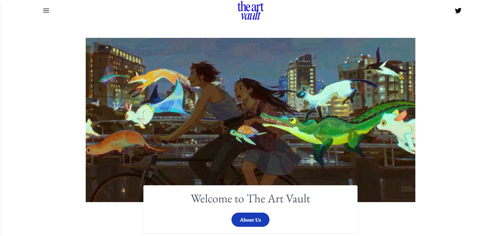
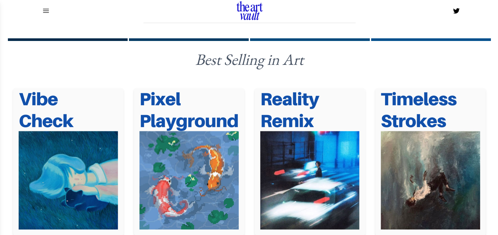
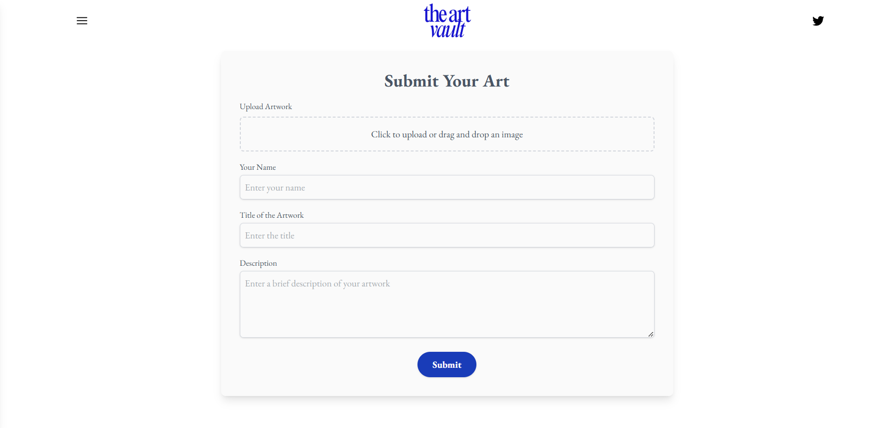

# 🎨💙The Art Vault

Art Vault is a dynamic online art gallery where users can upload, showcase, and explore artwork. Built with React, Vite, JavaScript, and Tailwind CSS, the platform provides a seamless experience for artists and art enthusiasts.

## ✨ Features

- **🖼️ Artwork Upload**: Users can submit their artwork via a form.
- **📸 Dynamic Gallery**: Displays submitted art dynamically.
- **🚀 Deployment**: Hosted on Vercel.

## 🛠 Tech Stack

- **🖥 Frontend**: React + Vite, JavaScript, Tailwind CSS
- **☁️ Deployment**: Vercel

## 🖼️ Gallery




## 📂 Project Structure

```
src/
├── assets/          # Icons and other assets
├── pages/
│   ├── Home.jsx    # Landing page
├── components/
│   ├── Navbar.jsx  # Navigation bar
│   ├── Gallery.jsx # Displays submitted art
│   ├── Form.jsx    # Upload form for artwork
│   ├── Footer.jsx  # Footer bar
```

## ⚙️ Installation & Setup

1. 📥 Clone the repository:
   ```bash
   git clone https://github.com/levanter914/the-art-vault.git
   cd art-vault
   ```
2. 📦 Install dependencies:
   ```bash
   npm install
   ```
3. ▶️ Run the development server:
   ```bash
   npm run dev
   ```


## 🤝 Contributing

Feel free to contribute by submitting issues or pull requests. Ensure your changes align with the project goals.

---

Enjoy using **Art Vault** and showcase your creativity! 🎨✨

